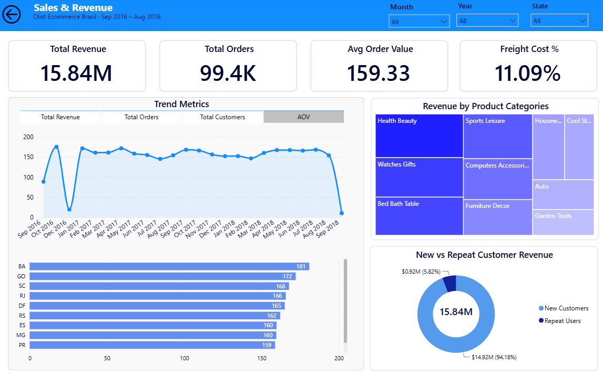
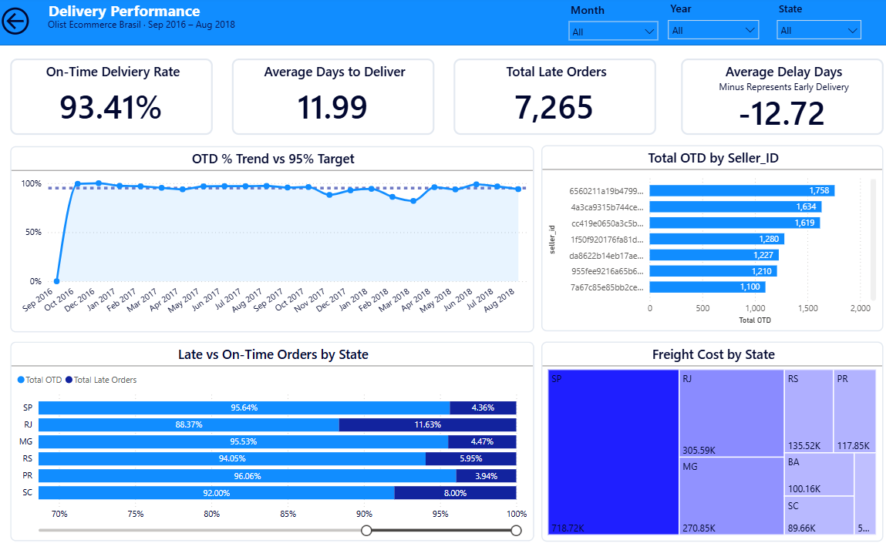
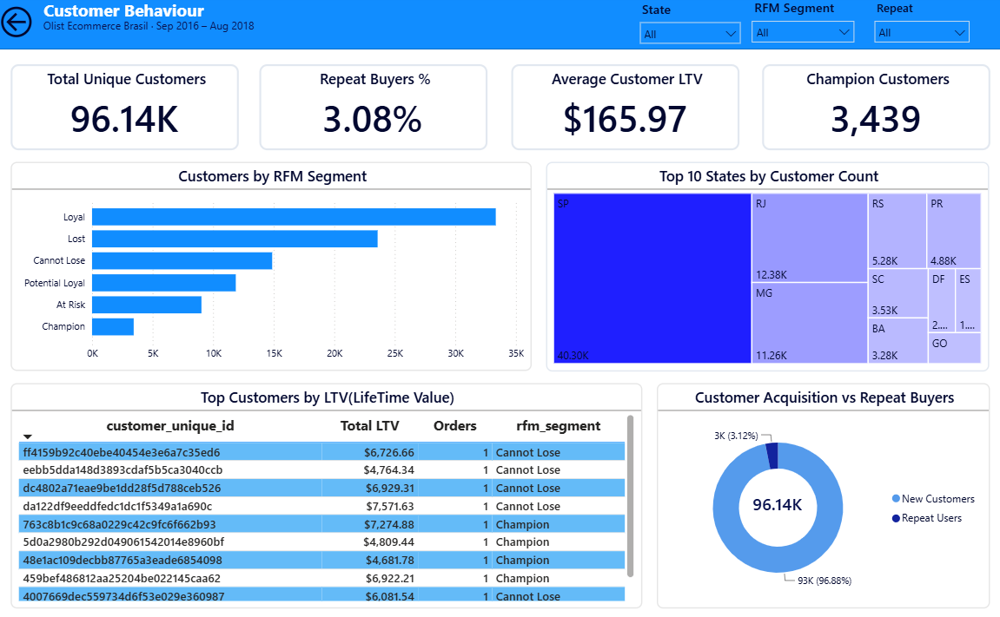
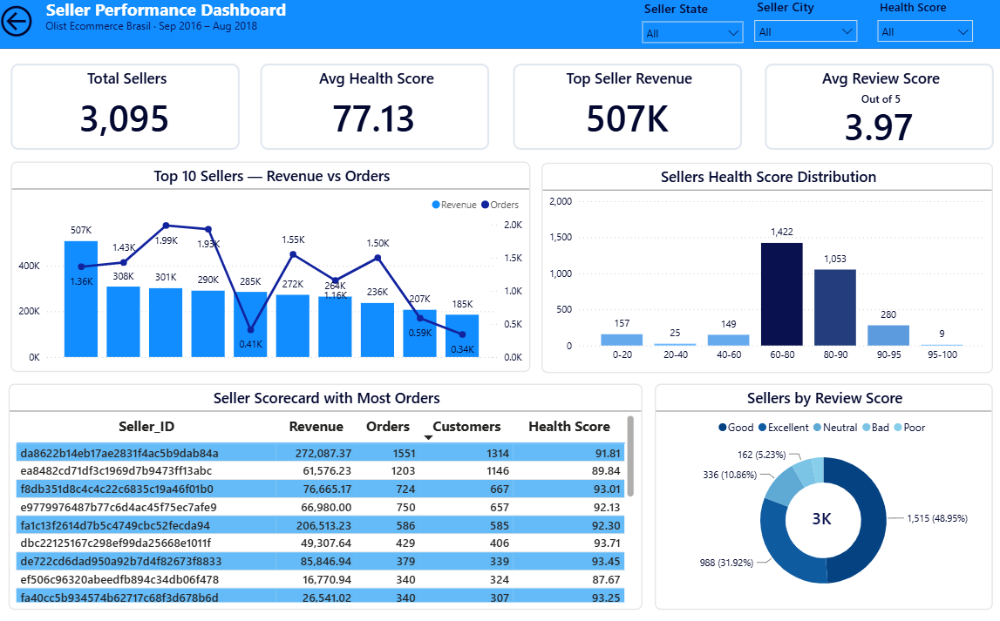
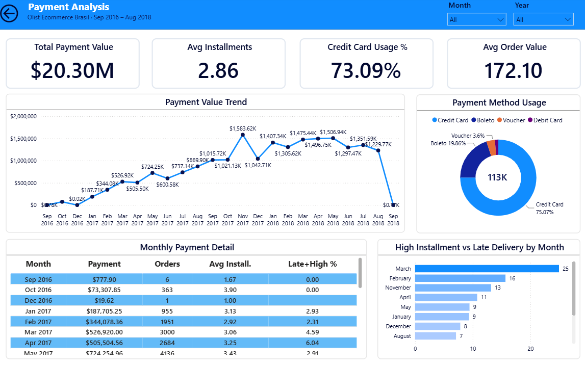

# 🛒 Olist Ecommerce Brasil — End-to-End Analytics Platform


> A complete end-to-end data engineering and business intelligence platform built on **Databricks Medallion Architecture** with **Unity Catalog** governance, **Delta Lake** storage, and **Power BI** dashboards — from raw CSV ingestion to executive-level analytics.

---

## 📌 Table of Contents

- [Project Overview](#-project-overview)
- [Dataset](#-dataset)
- [Architecture](#-architecture)
- [Tech Stack](#-tech-stack)
- [Bronze Layer](#-bronze-layer)
- [Silver Layer](#-silver-layer)
- [Gold Layer](#-gold-layer)
- [Power BI Dashboards](#-power-bi-dashboards)
- [Key Business Insights](#-key-business-insights)
- [Project Structure](#-project-structure)
- [How to Run](#-how-to-run)

---

## 🎯 Project Overview

This project demonstrates a production-grade analytics pipeline for **Olist** — Brazil's largest multi-vendor e-commerce marketplace. The platform ingests raw transactional data, applies a 3-layer Medallion Architecture for progressive data quality improvement, and delivers interactive Power BI dashboards for 5 key business domains.

**What makes this project different from a basic pipeline:**
- Real data quality issues identified and resolved with business logic decisions
- Advanced analytics: RFM customer segmentation, composite seller health scoring, delivery SLA tracking
- Star schema dimensional model optimized for Power BI consumption
- 6 themed dashboards with cross-page navigation and executive overview

---

## 📦 Dataset

**Source:** [Kaggle — Brazilian E-Commerce Public Dataset by Olist](https://www.kaggle.com/datasets/olistbr/brazilian-ecommerce)

| File | Description | Rows |
|---|---|---|
| olist_customers_dataset.csv | Customer profiles | 99,441 |
| olist_orders_dataset.csv | Order headers | 99,441 |
| olist_order_items_dataset.csv | Order line items | 112,650 |
| olist_order_payments_dataset.csv | Payment transactions | 103,886 |
| olist_order_reviews_dataset.csv | Customer reviews | 99,224 |
| olist_products_dataset.csv | Product catalog | 32,951 |
| olist_sellers_dataset.csv | Seller profiles | 3,095 |
| olist_geolocation_dataset.csv | Zip code coordinates | 1,000,163 |
| product_category_name_translation.csv | PT → EN categories | 71 |

**Total raw records:** ~1.5 million  
**Date range:** September 2016 — August 2018

---

## 🏗️ Architecture

```
┌─────────────────────────────────────────────────────────────┐
│                    DATA SOURCES                             │
│         9 CSV files uploaded to Databricks Volume          │
│    /Volumes/olist_ecommerce_project/raw/dataset/           │
└─────────────────────────┬───────────────────────────────────┘
                          │
                          ▼
┌─────────────────────────────────────────────────────────────┐
│                   BRONZE LAYER                              │
│         Raw ingestion · Type casting · Audit columns        │
│              9 Delta tables · Schema: bronze                │
└─────────────────────────┬───────────────────────────────────┘
                          │
                          ▼
┌─────────────────────────────────────────────────────────────┐
│                   SILVER LAYER                              │
│      Data cleaning · Validation · Enrichment · Dedup       │
│              8 Delta tables · Schema: silver                │
└─────────────────────────┬───────────────────────────────────┘
                          │
                          ▼
┌─────────────────────────────────────────────────────────────┐
│                    GOLD LAYER                               │
│    Star Schema + Data Marts · Business logic · Analytics   │
│             12 Delta tables · Schema: gold                  │
│   ┌──────────────┐ ┌────────────┐ ┌─────────────────────┐  │
│   │ 5 Dimensions │ │ 1 Fact     │ │ 6 Data Marts        │  │
│   │ dim_date     │ │ fact_orders│ │ mart_sales          │  │
│   │ dim_customers│ │            │ │ mart_delivery       │  │
│   │ dim_products │ │            │ │ mart_customer       │  │
│   │ dim_sellers  │ │            │ │ mart_seller         │  │
│   │ dim_geography│ │            │ │ mart_payment        │  │
│   └──────────────┘ └────────────┘ │ mart_review         │  │
│                                   └─────────────────────┘  │
└─────────────────────────┬───────────────────────────────────┘
                          │
                          ▼
┌─────────────────────────────────────────────────────────────┐
│                   POWER BI LAYER                            │
│     6 Themed Reports + 1 Executive Master Dashboard        │
│            Import Mode · DAX Measures · Navigation         │
└─────────────────────────────────────────────────────────────┘
```

### Unity Catalog Namespace
```
olist_ecommerce_project (catalog)
├── raw (schema)       → Volume landing zone
├── bronze (schema)    → 9 ingestion tables
├── silver (schema)    → 8 cleaned tables
└── gold (schema)      → 12 analytical tables
```

### Naming Conventions

| Layer | Prefix | Example |
|---|---|---|
| Bronze | `brz_` | `brz_orders` |
| Silver | `slv_` | `slv_orders` |
| Gold Dimensions | `dim_` | `dim_customers` |
| Gold Facts | `fact_` | `fact_orders` |
| Gold Marts | `mart_` | `mart_sales_overview` |

---

## 🛠️ Tech Stack

| Tool | Purpose |
|---|---|
| **Databricks Community Edition** | Compute, notebooks, cluster management |
| **Unity Catalog** | 3-level namespace governance and access control |
| **Delta Lake** | ACID transactions, schema enforcement, time travel |
| **PySpark** | Data transformations and aggregations |
| **Spark SQL** | Complex queries and window functions |
| **Power BI Desktop** | Dashboards, DAX measures, page navigation |

---

## 🥉 Bronze Layer

**Purpose:** Ingest raw CSV files as Delta tables with minimal transformation. Bronze mirrors the source exactly — no business logic, only type safety and audit trails.

**Standard applied to every table:**
- Explicit column type casting (no inferred schemas)
- Added `_ingestion_timestamp` and `_source_file` audit columns
- Write mode: `overwrite` with Delta format

### Tables Built

| Table | Source | Key Transformations |
|---|---|---|
| `customers` | olist_customers_dataset.csv | zip_code_prefix → string |
| `brz_geolocation` | olist_geolocation_dataset.csv | lat/lng → double |
| `brz_products` | olist_products_dataset.csv | Renamed `lenght` → `length` (typo fix) |
| `brz_sellers` | olist_sellers_dataset.csv | zip_code_prefix → string |
| `brz_category_translation` | product_category_name_translation.csv | PT → EN lookup |
| `brz_orders` | olist_orders_dataset.csv | 5 timestamps → ISO format using `.cast("timestamp")` |
| `brz_order_items` | olist_order_items_dataset.csv | `to_timestamp(col, "M/d/yyyy H:mm")` — non-ISO format |
| `brz_payments` | olist_order_payments_dataset.csv | payment_sequential → integer |
| `brz_reviews` | olist_order_reviews_dataset.csv | `multiLine=True, quote='"', escape='"'` for free text |

### Real Issues Caught at Bronze

**Issue 1: Mixed Date Formats**
```
Orders table:      ISO format (2017-09-13 08:59:02) → .cast("timestamp") works
Order items table: M/d/yyyy H:mm format → requires to_timestamp(col, "M/d/yyyy H:mm")
Reviews table:     Same M/d/yyyy H:mm format as order items
```

**Issue 2: CSV Column Misalignment in Reviews**
```
Problem: review_comment_message contained commas and newlines
         causing all subsequent columns to shift
Fix:     option("multiLine", True)
         option("quote", '"')
         option("escape", '"')
```

**Issue 3: Column Naming Typo in Products**
```
Source column:  product_name_lenght (typo)
Fixed to:       product_name_length
Approach:       Cast first with original typo name → then rename → overwriteSchema=True
```

---

## 🥈 Silver Layer

**Purpose:** Full data quality treatment, validation, and enrichment. Silver reads from Bronze only — never from raw files. No business aggregations at this layer.

**Standard applied to every table:**
- Drop `_source_file` (keep `_ingestion_timestamp`)
- Validate data types, nulls, duplicates, referential integrity
- Enrich with calculated columns where needed
- Write mode: `overwrite`

### Tables Built

| Table | Rows In | Rows Out | Key Actions |
|---|---|---|---|
| `slv_customers` | 99,441 | 99,441 | ✅ No issues — zero nulls, consistent casing |
| `slv_sellers` | 3,095 | 3,095 | 🔧 Dynamic regex city cleaning |
| `slv_geolocation` | 1,000,163 | 19,010 | 🔧 Outlier removal, deduplication |
| `slv_products` | 32,951 | 32,951 | 🔧 Null categories filled, EN names joined |
| `slv_orders` | 99,441 | 99,441 | 🔧 Bad rows flagged, delivery metrics added |
| `slv_order_items` | 112,650 | 112,650 | ✅ Referential integrity validated |
| `slv_payments` | 103,886 | 99,437 | 🔧 Invalid rows dropped, aggregated to order level |
| `slv_reviews` | 99,224 | 98,673 | 🔧 Deduplicated, sentiment added |

### Key Data Quality Decisions

| Issue Found | Decision | Reason |
|---|---|---|
| 610 null product categories | Fill with `'unknown'` | Products had valid dimensions — real revenue |
| 789 duplicate review IDs | Keep latest by timestamp | Most recent sentiment is most relevant |
| 8 delivered orders with no delivery date | Flag with `is_delivery_date_missing = True` | Preserve data, mark as unreliable |
| 3 payments with `not_defined` type and zero value | Drop | Zero business value |
| 383 zero-freight order items | Keep as-is | Legitimate free shipping promotions |
| 42 geolocation outliers outside Brazil | Drop | Clearly erroneous coordinates |

### Silver Enrichments Added

**slv_sellers — Dynamic City Name Cleaning (6-step regex pipeline):**
```python
# Step 1: Null purely numeric values (zip codes in city column)
# Step 2: Null emails (contains @)
# Step 3: Remove parenthetical content: \s*\(.*?\)
# Step 4: Remove everything after separators: \s*[/\\,\-]\s*.*$
# Step 5: Remove trailing 2-letter state codes: \s+[a-z]{2}$
# Step 6: Null remaining 2-letter or empty values: ^[a-z]{0,2}$
```

**slv_geolocation — Deduplication Strategy:**
```python
# 1M rows → 19,010 (one per zip prefix)
# Step 1: Filter outliers outside Brazil bounding box
#         Lat: -33.75 to 5.27 | Lng: -73.99 to -34.79
# Step 2: Most frequent city per zip using row_number() (not rank — avoids ties)
# Step 3: Average lat/lng per zip prefix after filtering
# Step 4: Join averaged coords with city winner
```

**slv_orders — Delivery Metrics Added:**
```python
delivery_delay_days = datediff(delivered_date, estimated_date)
# Positive = late, Negative = early delivery, Null = not delivered
is_late = True when delay > 0
```

**slv_reviews — Sentiment Classification:**
```python
sentiment_category = 
    score >= 4 → 'positive'
    score == 3 → 'neutral'  
    score <= 2 → 'negative'
```

---

## 🥇 Gold Layer

**Purpose:** Business intelligence layer — star schema for Power BI consumption. Gold reads from Silver only. Never from Bronze.

### Tier 1: Star Schema

#### Dimensions

| Table | Rows | Description |
|---|---|---|
| `dim_date` | 1,096 | Generated in PySpark — 2016-01-01 to 2018-12-31 |
| `dim_customers` | 99,441 | Customer profiles with state/city/zip |
| `dim_products` | 32,951 | Products with English category names |
| `dim_sellers` | 3,095 | Seller profiles with location |
| `dim_geography` | 19,010 | Zip prefix → city → state with lat/lng |

**dim_date columns:**
```
date_key (YYYYMMDD integer), full_date, day_of_week, day_of_month,
week_of_year, month_number, month_name, quarter, year,
is_weekend, is_month_end, is_quarter_end, is_black_friday,
season (Brazilian Southern Hemisphere seasons)
```

#### Fact Table: `fact_orders` (99,441 rows — one per order)

Consolidated fact table combining orders + items + payments + reviews:

| Column Group | Key Columns |
|---|---|
| **Keys** | order_id, customer_id, order_status, date_key |
| **Dates** | order_purchase_timestamp, order_approved_at, order_delivered_carrier_date, order_delivered_customer_date, order_estimated_delivery_date |
| **Delivery** | delivery_delay_days, is_late, is_delivery_date_missing |
| **Items** | total_items_count, distinct_products_count, total_price, total_freight_value, total_order_value |
| **Payments** | total_payment_value, payment_types (array), payment_methods_used, max_payment_installments |
| **Reviews** | review_score, sentiment_category, has_comment |

### Tier 2: Data Marts

#### `mart_sales_overview` (24 rows — monthly)
```
Metrics: gross_revenue, total_orders, total_customers,
         avg_order_value, avg_freight_value,
         freight_to_revenue_ratio_pct
Use:     Revenue dashboard, trend analysis, KPI cards
```

#### `mart_delivery_performance` (23 rows — monthly)
```
Metrics: total_orders_delivered, total_orders_late,
         on_time_delivery_rate_pct, avg_delivery_delay_days,
         avg_days_to_deliver, avg_freight_value
Use:     Operations dashboard, SLA monitoring
```

#### `mart_customer_behavior` (96,136 rows — per customer)
```
Metrics: total_orders, total_revenue, avg_order_value,
         first_purchase_date, last_purchase_date,
         days_since_last_order, is_repeat_customer, cohort_month,
         rfm_recency_score (1-5), rfm_frequency_score (1-5),
         rfm_monetary_score (1-5), rfm_total_score (3-15),
         rfm_segment (Champion/Loyal/Potential Loyal/At Risk/Cannot Lose/Lost)

RFM Implementation:
  NTILE(5) window function over global dataset
  No partition — intentional for global customer scoring
  Segment rules applied via WHEN conditions on combined scores
```

#### `mart_seller_scorecard` (3,095 rows — per seller)
```
Metrics: total_orders, total_customers, gross_revenue,
         avg_order_value, on_time_delivery_rate_pct,
         avg_review_score, total_reviews, revenue_rank,
         seller_health_score

Composite Health Score Formula:
  seller_health_score = (on_time_norm × 0.40)
                      + (rating_norm × 0.30)
                      + (revenue_percentile × 0.30)
  Range: 0-100 | Top sellers: 85-96
```

#### `mart_payment_analysis` (24 rows — monthly)
```
Metrics: credit_card_orders, boleto_orders, voucher_orders,
         debit_card_orders, credit_card_pct, boleto_pct,
         voucher_pct, debit_card_pct, avg_installments,
         avg_order_value,
         high_installment_late_delivery_rate_pct

Note: Payment types stored as ARRAY in fact_orders
      → array_contains() used for filtering (not .contains())
```

#### `mart_review_sentiment` (24 rows — monthly)
```
Metrics: total_reviews, avg_review_score,
         positive_reviews, neutral_reviews, negative_reviews,
         positive_review_pct, negative_review_pct,
         reviews_with_comments_pct, weighted_sentiment_score,
         avg_score_late_orders, avg_score_ontime_orders,
         late_orders_negative_review_pct,
         sentiment_trend_change (LAG window function)
```

### Advanced Analytics Techniques Used

| Technique | Implementation | Purpose |
|---|---|---|
| `NTILE(5)` | RFM scoring | Classify customers into 5 equal buckets |
| `RANK()` | Seller revenue ranking | Global revenue leaderboard |
| `LAG()` | Sentiment MoM trend | Month-over-month change detection |
| `PERCENT_RANK()` | Revenue normalization | 0-100 percentile for health score |
| `ROW_NUMBER()` | Geolocation dedup | Pick most frequent city per zip |
| `try_divide()` | Safe arithmetic | Handle division by zero for sellers with no deliveries |
| `array_contains()` | Payment type filtering | Query ARRAY column for specific payment method |
| `datediff()` | Delivery delay | Calculate days between estimated and actual delivery |

---

## 📊 Power BI Dashboards

**Connection:** Databricks Partner Connect → Import mode  
**Model:** fact_orders connected to dim_date and dim_customers  
**Mart tables:** Standalone (self-contained, no relationships needed)

### Data Model Relationships
```
fact_orders[date_key]     → dim_date[date_key]      Many-to-One ✅
fact_orders[customer_id]  → dim_customers[customer_id] Many-to-One ✅

All mart tables: Standalone (pre-aggregated, slicers from mart columns)
```

### Key DAX Measures

```dax
Total Revenue = SUM(fact_orders[total_order_value])

Total Orders = COUNTROWS(fact_orders)

Avg Order Value = DIVIDE([Total Revenue], [Total Orders])

Freight Cost % = 
DIVIDE(
    SUM(fact_orders[total_freight_value]),
    SUM(fact_orders[total_order_value])
) * 100

On Time Rate % = 
DIVIDE(
    COUNTROWS(FILTER(fact_orders, fact_orders[is_late] = "FALSE")),
    COUNTROWS(FILTER(fact_orders, fact_orders[order_status] = "delivered"))
) * 100

Avg Days to Deliver = 
AVERAGEX(
    FILTER(fact_orders, fact_orders[order_delivered_customer_date] <> BLANK()),
    DATEDIFF(
        fact_orders[order_purchase_timestamp],
        fact_orders[order_delivered_customer_date],
        DAY
    )
)

Repeat Buyers % = 
DIVIDE(
    COUNTROWS(FILTER(mart_customer_behavior,
        mart_customer_behavior[is_repeat_customer] = "TRUE")),
    COUNTROWS(mart_customer_behavior)
) * 100

Champion Customers = 
COUNTROWS(
    FILTER(mart_customer_behavior,
        mart_customer_behavior[rfm_segment] = "Champion")
)

Top Seller Revenue = 
MAXX(mart_seller_scorecard, mart_seller_scorecard[gross_revenue])
```

### Dashboard Pages

#### Page 1: Executive Business Overview (Master)
```
6 KPI Cards (one per business domain) with page navigation actions
├── Revenue vs Orders dual trend line chart
├── Customer RFM segments donut
├── On-time rate by state progress bars
├── Payment method mix donut
└── Top 10 sellers table with health scores
Navigation: 5 buttons linking to each detail page
Back button: On every detail page returning to overview
```

#### Page 2: Sales & Revenue
```
KPIs: Total Revenue | Total Orders | Avg Order Value | Freight Cost %
├── Trend Metrics (toggle buttons: Revenue / Orders / Customers / AOV)
├── Revenue by Product Categories (Treemap)
├── Revenue by State (Bar chart)
└── New vs Repeat Customer Revenue (Donut)
Slicers: Month | Year | Customer State
```

#### Page 3: Delivery Performance
```
KPIs: On-Time Rate | Avg Days to Deliver | Total Late Orders | Avg Delay Days
├── OTD % Trend vs 95% Target (Line + constant dashed line)
├── Late vs On-Time by State (100% Stacked bar)
├── Top Sellers by OTD Rate (Bar)
└── Freight Cost by State (Treemap)
Slicers: Month | Year | State
```

#### Page 4: Customer Behavior
```
KPIs: Unique Customers | Repeat Buyers % | Avg LTV | Champion Customers
├── Customers by RFM Segment (Horizontal bar)
├── Top 10 States by Customer Count (Treemap)
├── Top Customers by LTV (Table with segments)
└── Customer Acquisition vs Repeat Buyers (Donut)
Slicers: State | RFM Segment | Repeat
Source: mart_customer_behavior (standalone)
```

#### Page 5: Seller Performance
```
KPIs: Total Sellers | Avg Health Score | Top Seller Revenue | Avg Review Score
├── Top 10 Sellers: Revenue vs Orders (Clustered bar)
├── Health Score Distribution (Column chart with color bands)
├── Seller Scorecard (Table: Revenue, Orders, On-Time%, Health)
└── Sellers by Review Score (Bar: 1-Bad to 5-Excellent)
Slicers: Seller State | Seller City | Health Score
Source: mart_seller_scorecard (standalone)
```

#### Page 6: Payment Analysis
```
KPIs: Total Payment Value | Avg Installments | Credit Card % | Avg Order Value
├── Payment Value Trend (Line chart)
├── Payment Method Usage (Donut: Credit Card/Boleto/Voucher/Debit)
├── Monthly Payment Detail (Table with Late+High % column)
└── High Installment vs Late Delivery by Month (Bar)
Slicers: Month | Year
Source: mart_payment_analysis (standalone)
```

---

## 💡 Key Business Insights

| # | Insight | Finding |
|---|---|---|
| 1 | **Geographic concentration** | SP (São Paulo) drives 37% of revenue and 43% of all customers |
| 2 | **Customer retention gap** | Only 3.48% of customers are repeat buyers — massive retention opportunity |
| 3 | **Delivery impact on satisfaction** | Late orders avg 2.0/5 review vs 4.2/5 for on-time orders |
| 4 | **Payment preference** | Credit card dominates at 73% with avg 2.86 installments |
| 5 | **Top category** | Health Beauty is #1 revenue category, followed by Watches & Gifts |
| 6 | **Installment risk** | April 2017 had 6.04% late delivery rate for high-installment orders |
| 7 | **Seller concentration** | Top seller generated 507K BRL — 3.2% of total platform revenue |
| 8 | **Early delivery norm** | Average delay of -13.4 days means most orders arrive before estimated date |

---

## 📁 Project Structure

```
olist-ecommerce-analytics/
│
├── README.md
│
├── notebooks/
│   ├── bronze/
│   │   └── bronze_ingestion.ipynb
│   ├── silver/
│   │   ├── silver_customers_sellers.ipynb
│   │   ├── silver_geolocation_products.ipynb
│   │   ├── silver_orders_items.ipynb
│   │   └── silver_payments_reviews.ipynb
│   └── gold/
│       ├── gold_01_dimensions.ipynb
│       ├── gold_02_fact_orders.ipynb
│       ├── gold_03_mart_sales.ipynb
│       ├── gold_04_mart_delivery.ipynb
│       ├── gold_05_mart_customer.ipynb
│       ├── gold_06_mart_seller.ipynb
│       ├── gold_07_mart_payment.ipynb
│       └── gold_08_mart_sentiment.ipynb
│
├── reports/
│   └── screenshots/
│       ├── 01_executive_overview.png
│       ├── 02_sales_revenue.png
│       ├── 03_delivery_performance.png
│       ├── 04_customer_behavior.png
│       ├── 05_seller_performance.png
│       └── 06_payment_analysis.png
│
└── docs/
    └── Project_Summary.md
```

---

## ▶️ How to Run

### Prerequisites
- Databricks account (Community Edition works)
- Unity Catalog enabled on your workspace
- Power BI Desktop (Windows)
- Kaggle account to download the dataset

### Step 1: Set Up Databricks
```python
# Create catalog and schemas
spark.sql("CREATE CATALOG IF NOT EXISTS olist_ecommerce_project")
spark.sql("CREATE SCHEMA IF NOT EXISTS olist_ecommerce_project.raw")
spark.sql("CREATE SCHEMA IF NOT EXISTS olist_ecommerce_project.bronze")
spark.sql("CREATE SCHEMA IF NOT EXISTS olist_ecommerce_project.silver")
spark.sql("CREATE SCHEMA IF NOT EXISTS olist_ecommerce_project.gold")
```

### Step 2: Upload Dataset
1. Download dataset from Kaggle
2. Upload all 9 CSV files to:
   `/Volumes/olist_ecommerce_project/raw/dataset/`

### Step 3: Run Notebooks in Order
```
1. notebooks/bronze/bronze_ingestion.ipynb
2. notebooks/silver/silver_*.ipynb (any order)
3. notebooks/gold/gold_01_dimensions.ipynb
4. notebooks/gold/gold_02_fact_orders.ipynb
5. notebooks/gold/gold_03 to gold_08 (any order)
```

### Step 4: Connect Power BI
1. Open Power BI Desktop
2. Get Data → Databricks
3. Server: `your-workspace.cloud.databricks.com`
4. Catalog: `olist_ecommerce_project`
5. Schema: `gold`
6. Load all 12 tables
7. Create relationships:
   - `fact_orders[date_key]` → `dim_date[date_key]`
   - `fact_orders[customer_id]` → `dim_customers[customer_id]`

---

## 📊 Dashboard Screenshots

### Executive Business Overview


### Sales & Revenue


### Delivery Performance


### Customer Behavior


### Seller Performance


### Payment Analysis


---

## 🤝 Connect

If you found this project helpful or have questions about any layer of the implementation, feel free to connect!

[](https://linkedin.com/in/yourprofile)
[](https://github.com/yourusername)

---

*Built with ❤️ using Databricks, Delta Lake, PySpark, and Power BI*
